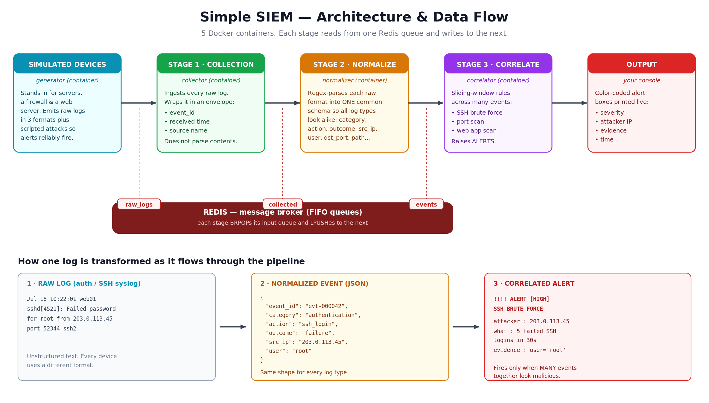

# Understanding SIEM — with a Simple, Working Example

A hands-on guide to what a **SIEM** is and how it works, built around a tiny,
console-based, Docker-powered SIEM you can run on your own laptop.

> **New here?** For quick run instructions see the [README](README.md). This
> document is the deeper explainer: the concepts, the architecture, and how each
> part of the code maps to a real SIEM.

---

## Architecture & data flow



*Five Docker containers. Each stage reads from one Redis queue and writes to the
next. A log enters as raw text on the left and leaves as a correlated alert on
the right.*

---

## 1. What is a SIEM?

A **SIEM** — *Security Information and Event Management* — is the system a
security team uses to watch everything happening across a network in one place.

Every server, firewall, router, application, and cloud service constantly
produces **logs**: small text records of who did what and when. On their own,
those logs are scattered across hundreds of machines, written in dozens of
incompatible formats, and far too numerous for any human to read. A SIEM exists
to solve that problem.

At its core, a SIEM does three things — and this project is organised around
exactly those three stages:

1. **Collection** — gather logs from every source into one pipeline.
2. **Normalization** — translate every log format into one common structure so
   they can be compared.
3. **Correlation & Alerting** — analyse many events together to detect attacks,
   and raise an alert when something looks malicious.

Real SIEMs (Splunk, Elastic Security, Microsoft Sentinel, Wazuh, and others) add
storage, search, dashboards, and long-term retention on top. But the three
stages above are the beating heart of every one of them.

### Why not just read the logs directly?

Imagine a single failed SSH login on one server. Harmless — people mistype
passwords. Now imagine **ten** failed logins from the same foreign IP in thirty
seconds, immediately followed by a **success**. That is almost certainly an
attacker who just guessed a password.

No human watches every server at 3 a.m., and the meaningful signal is spread
across many individual log lines. A SIEM connects those dots automatically. That
connecting-the-dots is called **correlation**, and it is the reason SIEMs exist.

---

## 2. The three stages, and how this system demonstrates each one

### Stage 1 — Collection · [`src/collector.py`](src/collector.py)

**The concept:** pull raw logs in from every source and get them into a single
pipeline, without yet trying to understand their contents. This is the SIEM's
front door.

**In this system:** the `collector` container reads every raw log off a queue and
wraps each one in a common *envelope* — a unique `event_id`, the time it was
received, and which source it came from — then passes it on. It deliberately does
**not** parse the message yet, which keeps the stage's single job obvious.

### Stage 2 — Normalization · [`src/normalizer.py`](src/normalizer.py)

**The concept:** different devices describe the same kind of event in completely
different text. Normalization rewrites all of them into **one shared schema**, so
an SSH log, a firewall log, and a web-server log can be counted and compared
using the same fields. This is the single most important idea in a SIEM.

**In this system:** the `normalizer` applies one regular expression per source
format and produces a uniform JSON event. Three unrecognisable raw lines become
three events with an identical shape:

```
RAW (auth)      Jul 18 10:22:01 web01 sshd[4521]: Failed password for
                root from 203.0.113.45 port 52344 ssh2
RAW (firewall)  FW: DENY TCP 198.51.100.23:44123 -> 10.0.0.5:3389 len=52
RAW (web)       192.0.2.10 - - [...] "GET /admin.php HTTP/1.1" 404 512 "sqlmap/1.5"
```

```jsonc
// after normalization, the auth line becomes:
{
  "event_id": "evt-000042",
  "category": "authentication",
  "action":   "ssh_login",
  "outcome":  "failure",
  "src_ip":   "203.0.113.45",
  "user":     "root"
}
```

### Stage 3 — Correlation & Alerting · [`src/correlator.py`](src/correlator.py)

**The concept:** examine many normalized events over a window of time and decide
when a *pattern* is an attack. One event rarely matters; the relationship between
events does.

**In this system:** the `correlator` keeps a short, per-IP sliding-window history
in memory and runs a small set of detection rules on every event. When a rule's
threshold is crossed, it prints a colour-coded alert box to the console.

| Rule | Fires when | Severity |
|------|-----------|----------|
| SSH brute force | ≥ 5 failed SSH logins from one IP within 30s | HIGH |
| Brute-force success | a successful login right after those failures | CRITICAL |
| Port scan | one IP blocked on ≥ 10 different ports within 30s | MEDIUM |
| Web application scan | ≥ 4 suspicious web requests (sqlmap, `/admin`, `../`, SQLi) | HIGH |

All thresholds are plain constants at the top of `correlator.py`. Change them,
re-run, and watch how detection sensitivity — and false positives — change.

---

## 3. How the system is built

The whole thing runs as **five Docker containers** started with a single
command. Four are short Python programs that share one Docker image; the fifth is
Redis, the conveyor belt between stages.

| Container | Role |
|-----------|------|
| `generator` | Simulated network devices. Emits fake auth / firewall / web logs as background noise, and periodically launches a **scripted attack** so alerts reliably fire. *(Not a SIEM stage — it stands in for the real world.)* |
| `collector` | **Stage 1 — Collection** |
| `normalizer` | **Stage 2 — Normalization** |
| `correlator` | **Stage 3 — Correlation & Alerting** |
| `redis` | In-memory store used as simple FIFO queues between stages |

The stages never call each other directly. Each one only reads from its input
queue and writes to the next:

```python
while True:
    msg = pop(from_my_input_queue)     # BRPOP: sleep until work arrives
    result = do_my_job(msg)            # collect / normalize / correlate
    push(to_the_next_queue, result)    # LPUSH: hand off to the next stage
```

The three queues carry data along the pipeline:

```
generator  --[ raw_logs  ]-->  collector
collector  --[ collected ]-->  normalizer
normalizer --[ events    ]-->  correlator  -->  ALERTS on your screen
```

Because the stages are decoupled through queues, each is an independent container
that could be scaled, restarted, or replaced on its own. This is exactly how
production SIEM pipelines separate ingestion, parsing, and detection — just with
heavier tools (Kafka, Logstash, and so on) in place of Redis and Python.

### Project layout

```
simple-siem/
├── docker-compose.yml        # starts all 5 containers with one command
├── Dockerfile                # one image, shared by all Python services
├── requirements.txt          # just the redis client
├── README.md                 # quick start
├── DOCUMENTATION.md          # this file
├── docs/
│   ├── architecture.png      # the diagram above
│   ├── architecture.svg      # editable source of the diagram
│   └── Understanding-SIEM.pdf# printable explainer
└── src/
    ├── common.py             # shared helpers (Redis, colours, queues)
    ├── generator.py          # simulated log sources + scripted attacks
    ├── collector.py          # STAGE 1: collection
    ├── normalizer.py         # STAGE 2: normalization
    └── correlator.py         # STAGE 3: correlation & alerting
```

---

## 4. How to run and use it

### Prerequisites

You only need **Docker Desktop** (or Docker Engine with the Compose plugin). No
Python setup is required on your machine — everything runs inside the containers.

### Start everything with one command

```bash
cd simple-siem
docker compose up --build
```

Docker builds one small image, then starts all five containers. Within a minute
or two you'll see colour-coded logs from every stage interleaved in your
terminal, and the correlator will begin printing red alert boxes when the
generator launches an attack.

### Focus on a single stage

The combined stream is busy on purpose — it shows the whole pipeline at once. To
watch just one stage, open a second terminal:

```bash
docker compose logs -f correlator     # just the alerts
docker compose logs -f normalizer     # watch raw logs become JSON
docker compose logs -f generator      # see the simulated attacks start
```

### Stop and clean up

```bash
# press Ctrl+C in the terminal running compose, then:
docker compose down
```

### What a firing alert looks like

```
!!!!!!!!!!!!!!!!!!!!!!!!!!!!!!!!!!!!!!!!!!!!!!!!!!!!!!!!!!!!
  ALERT #1  [HIGH]  SSH BRUTE FORCE
  attacker : 203.0.113.45
  what     : 5 failed SSH logins in 30s
  evidence : target user='root'
  time     : 2026-07-18 10:22:03
!!!!!!!!!!!!!!!!!!!!!!!!!!!!!!!!!!!!!!!!!!!!!!!!!!!!!!!!!!!!
```

Read it top to bottom: the severity and rule name tell you **what** was detected,
the attacker line tells you **who**, and the evidence line tells you **why** the
SIEM believes it is an attack.

---

## 5. Ideas for students to extend it

- **Add a new log source** (DNS or VPN logs): write a format in the generator, a
  matching regex in the normalizer, and a rule in the correlator.
- **Add an "impossible travel" rule:** alert when the same user logs in from two
  different countries within a short window.
- **Persist alerts:** write them to a file or a dedicated Redis queue, then build
  a tiny dashboard that reads them.
- **Tune the thresholds down** and watch false positives appear — the real tuning
  problem every security operations centre faces.

---

> ⚠️ **This is a learning tool, not a production security product.** All logs are
> synthetic and the detection logic is intentionally simplified so the core ideas
> stay visible.
